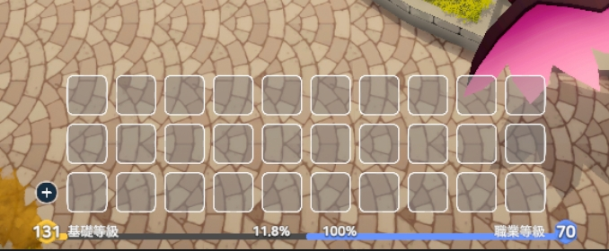
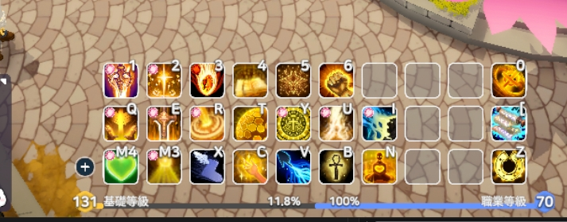
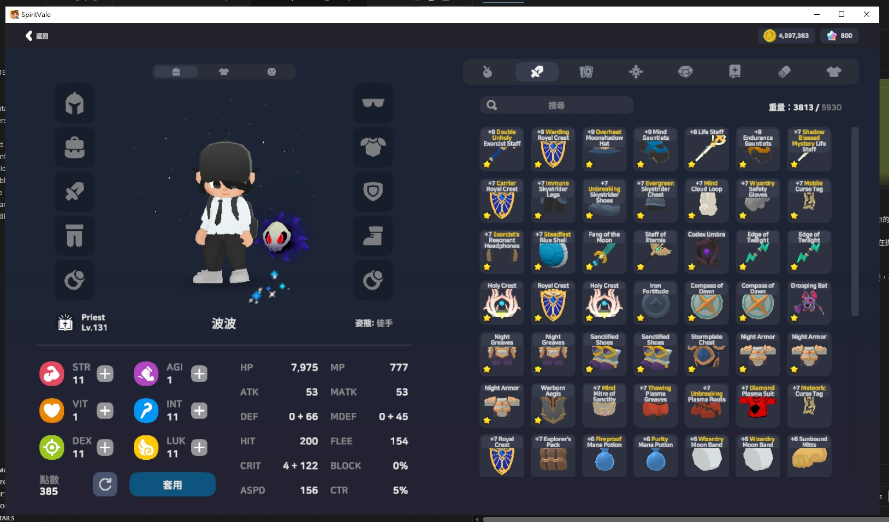
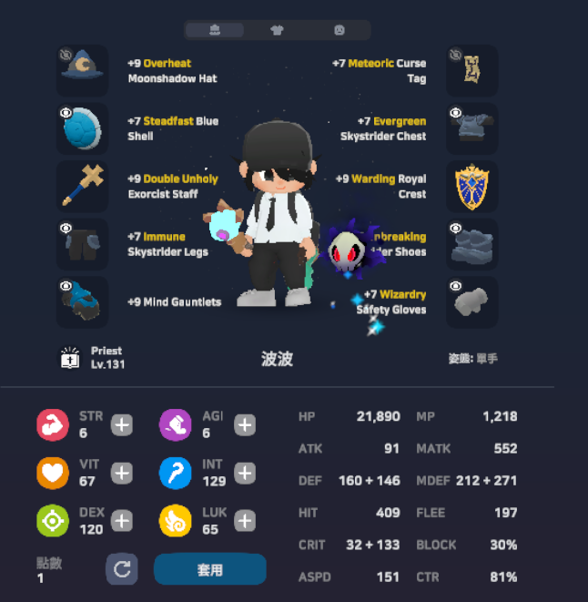
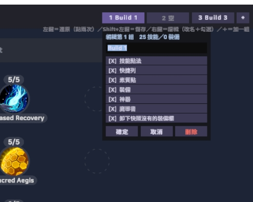

# SpiritVale Skill Builds（Build 切換）

打王要補血、練功要輸出，換一次流派就得重點一次技能、再把整排快捷鍵重擺一遍——
洗完點快捷列還會**整排消失**。

本插件讓你把 **技能點 ＋ 能力點 ＋ 裝備／神器／魔導書 ＋ 快捷列** 存成一個 Build，
之後**點兩下全部換回來**。

### 一鍵之前 → 一鍵之後

在 Waybinder 重置之後的狀態：快捷列整排空白、裝備全被卸下、385 點能力點待重配。

| 還原前 | 還原後 |
|---|---|
|  |  |
|  |  |

中間你只做了一件事：**在 Build 按鈕上點兩下**。

## 給玩家：三步安裝

1. 到 [Releases](https://github.com/Jyo238/SpiritVale-SkillBuilds/releases) 下載最新的一鍵安裝包 zip
2. 完整解壓縮後，關閉遊戲，雙擊 **`一鍵安裝.bat`**（自動偵測遊戲位置；沒裝過 BepInEx 會自動下載安裝）
3. 開遊戲。**首次啟動會多花 1~3 分鐘初始化屬正常**（已裝繁中翻譯包／其他 BepInEx Mod 者無此等待）

與「繁中翻譯包」「紫星販賣保護」「交易所比價」「詞條快篩 HUD」完全相容可共存。
出問題請雙擊 `產生診斷報告.bat`，把桌面上的報告貼到回報處。
**更新方式**：下載新版 zip 後重跑 `一鍵安裝.bat` 即可（會自動偵測並覆蓋舊版）。

## 操作

打開技能視窗，右上角會多一排 Build 按鈕。

| 操作 | 行為 |
|---|---|
| **Shift + 左鍵** | 把目前配置存進這一組 |
| **左鍵點兩次** | 還原這一組（第一次是確認，3 秒內再點一次） |
| **右鍵** | 編輯：改名、勾選要還原哪幾類、刪除 |
| **＋** | 再加一組（最多 12 組） |
| **Ctrl + F1~F6** | 熱鍵還原（不用開技能視窗） |
| **Ctrl+Shift + F1~F6** | 熱鍵儲存 |

還原順序：**套用點法 → 配能力點 → 換裝 → 綁快捷列**，畫面顯示每一步進度。
裝備必須排在快捷列之前——裝備賦予的技能要先回到身上，那些格子才綁得上。

## 每組可以只換一部分



右鍵開編輯面板，七個勾選各自開關：技能點／快捷列／能力點／裝備／神器／魔導書／卸下快照沒有的裝備欄。

**儲存時永遠全部記下來，勾選只決定還原時要動哪些**——隨時改主意都不用重存快照。
善用這點可以做出「只勾裝備」的**純換裝組**（打王裝／練功裝／打錢裝），完全不碰點法與能力點。
按鈕上顯示 `*` 即代表該組是部分還原。

## Build 存哪裡 / 換電腦

Build 依**角色**分開存（鍵是伺服器端的角色 id，同帳號不同角色互不干擾），檔案預設在
`<遊戲>\BepInEx\config\local.spiritvale.skillbuilds.presets.json`。

換電腦把這個檔案複製過去即可；或在設定檔填「存檔資料夾」指向雲端同步資料夾
（OneDrive／Google 雲端硬碟等），兩台電腦自動共用（別兩台同時開遊戲改，會打架）。

## 技術

- BepInEx 6（IL2CPP）+ HarmonyX，與 [SpiritVale-SellFavorite](https://github.com/Jyo238/SpiritVale-SellFavorite)、
  [SpiritVale-MarketPrice](https://github.com/Jyo238/SpiritVale-MarketPrice) 同一套工具鏈。
- **一行遊戲邏輯都沒有重造**：全程呼叫遊戲自己的客戶端入口——
  `PlayerSave.ApplySkills` / `ApplyAttributes` / `AssignSkill` /
  `ApplyEquip` / `ApplyArtifact` / `ApplyGrimoire`，
  與你在 UI 手動操作走的是同一條路，伺服器端驗證完全不變。
- **狀態機用「輪詢謂詞」推進**，不 patch 帶編譯雜湊的 RPC 方法：每一步伺服器回應都會把本地
  `CharacterData` 整包換新，所以直接對資料驗收（技能等級全對、能力點六項全對、該格裝備 uid 相符）
  才前進——不是送出就當成功，也不會因為遊戲改版動到方法雜湊就失效。
- **零 delegate、零類別注入**：UI 全部手建 `Image`/`TMP`/`TMP_InputField`，
  互動靠每幀 raycast 與按鍵輪詢（本遊戲的 Il2CppInterop 注入 hook 有崩潰前科，見 SellFavorite 的 README）。
- 逆向得到的關鍵事實：
  - **本插件不呼叫任何「重置」**：`ResetSkills` / `ResetAttributes` 是 Waybinder NPC 專屬入口。
    技能直接送最終點法（`ApplySkills` 收完整終態、可增可減，等同玩家右鍵退點後按套用）——
    隨地可用，而且是原子操作：伺服器要嘛整包接受、要嘛整包拒絕，失敗時原本的點法不會被動到。
    能力點只送**正差額**；需要調降時跳過能力點並提示玩家自己去 Waybinder 重置
    （伺服器端其實沒擋負差額，但那是遊戲介面做不到的事，刻意不做）
  - `ApplySkills` 收的是**完整終態清單**；`ApplyAttributes` 收的是**差額**
  - 換裝有伺服器閘門 `CheckCanChangeGear` → **戰鬥中禁止**，所以還原前先擋
  - **飾品左右欄由遊戲決定**（`ApplyEquip` 只收物品，遊戲用 `GetOccupiedSlot` 挑欄位）
    → 換裝跑完做總驗收＋**補裝重試**，第二輪另一格已佔住就自然歸位
- 防呆：啟動時以反射驗證三個 RPC 簽名，不符就停用還原並提示等待更新；
  發送碼全關在 `NoInlining` 方法內隔離；缺件／需求不符明確列出而非靜默略過。

## 建置

需要 .NET SDK 8+、遊戲已安裝 BepInEx 6.0.0-be.785（IL2CPP win-x64）且啟動過一次（產生 `BepInEx\interop\`）。

```powershell
dotnet build src\SpiritValeSkillBuilds.csproj -c Release
# 遊戲不在預設路徑時：-p:GameDir=<遊戲目錄>
Copy-Item src\bin\Release\net6.0\*.dll <遊戲>\BepInEx\plugins\SpiritValeSkillBuilds\
```

## 風險聲明

**線上遊戲使用第三方工具都有風險，請自行斟酌。**
**線上遊戲使用第三方工具都有風險，請自行斟酌。**
**線上遊戲使用第三方工具都有風險，請自行斟酌。**
可參考的事實：所有動作都走遊戲原生管道、
與手動操作發出的請求完全相同、不改數值、不偽造封包、不自動化戰鬥行為，
且本遊戲目前無反作弊程式。

MIT 授權。歡迎回報問題與改進建議。
